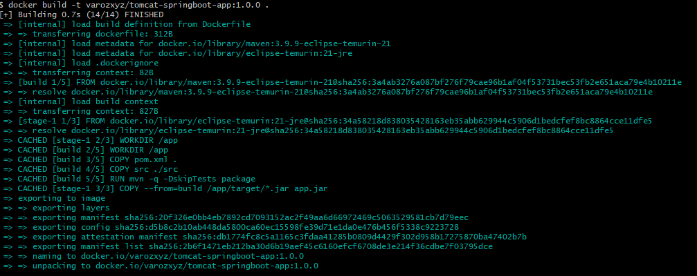
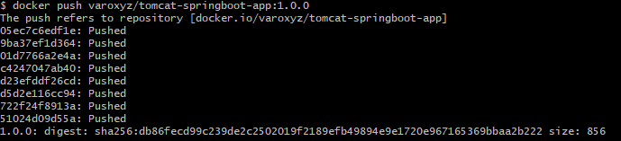
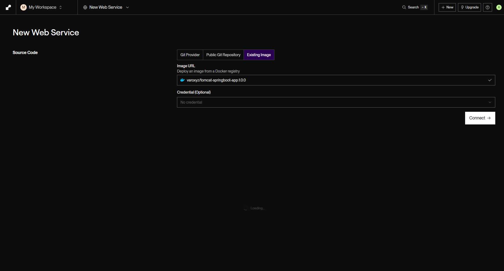
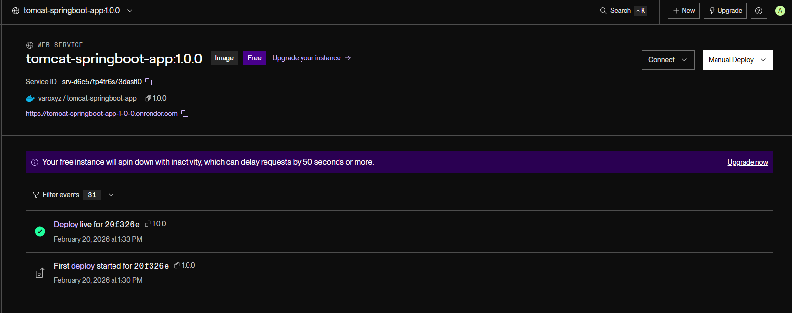
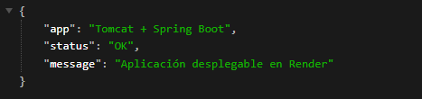
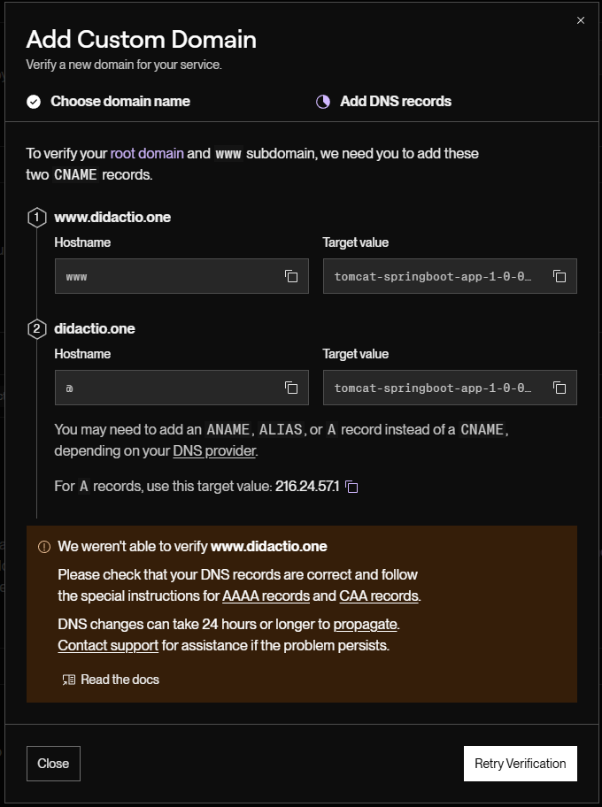
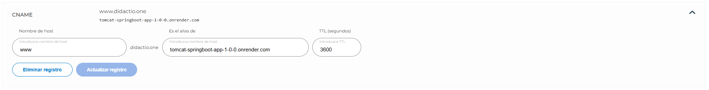
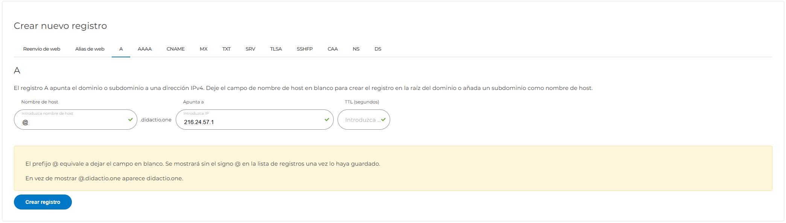

# Entrega - Actividad 1

## 1) Pasos para construir y subir la imagen de Docker

1. Construyo el proyecto:

   ```bash
   mvn clean package
   ```

2. Construyo la imagen:

   ```bash
   docker build -t TU_USUARIO_DOCKERHUB/tomcat-springboot-app:1.0.0 .
   ```

3. Inicio sesión en Docker Hub:

   ```bash
   docker login
   ```

4. Etiqueto la imagen con el usuario de Docker Hub:

   ```bash
   docker tag tomcat-springboot-app:local TU_USUARIO_DOCKERHUB/tomcat-springboot-app:1.0.0
   ```

5. Subo la imagen:

   ```bash
   docker push TU_USUARIO_DOCKERHUB/tomcat-springboot-app:1.0.0
   ```




## 2) Enlace de la imagen en Docker Hub

- URL de la imagen: **[Docker Hub](https://hub.docker.com/r/varoxyz/tomcat-springboot-app)**

## 3) Pasos para desplegar la aplicación en Render

1. Creo un `Web Service` en Render.
2. Selecciono despliegue desde imagen existente en registry.
3. Indico la imagen: `TU_USUARIO_DOCKERHUB/tomcat-springboot-app:1.0.0`.
4. Configuro el puerto `8080`.
5. Espero a que termine el deploy y pruebo:
   - `/`
   - `/health`





## 4) Pasos para configurar el dominio personalizado

1. En Render entro en `Settings > Custom Domains`.
2. Añado el dominio: **[www.didactio.one](https://didactio.one/)**.
3. En el proveedor DNS creo los registros solicitados por Render.
4. Verifico la propagación DNS y el certificado HTTPS.





## 5) Enlace final de la aplicación

- URL de la aplicación desplegada en Render: **[URL Render](https://tomcat-springboot-app-1-0-0.onrender.com/)**
- URL con dominio personalizado: **[URL Dominio](http://didactio.one)**

